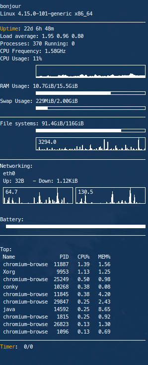

# Conkey



```conf
# --- predefined colors - http://www.kgym.jp/freesoft/xrgb.html --- #
color0 FFFFFF                           # white
color1 FFA500                           # orange
color2 B22222                           # firebrick
color3 696969                           # dim gray
color4 D3D3D3                           # light gray
color5 2F4F4F                           # dark slate gray
color6 FFEC8B                           # light golden rod
color7 54FF9F                           # sea green
color8 FF8C69                           # salmon
color9 FFE7BA                           # wheat

alignment top_left
gap_x 0
gap_y 0

double_buffer yes
background yes

default_color white
default_outline_color white
default_shade_color gray

draw_borders no
draw_graph_borders yes
draw_outline no
draw_shades no

use_xft yes
xftfont Meslo LG S:style=Regular:size=8
xftalpha 0.8

override_utf8_locale yes
out_to_console no
out_to_stderr no
extra_newline no

update_interval 1.0
uppercase no

show_graph_scale yes
show_graph_range no
own_window yes
own_window_class Conky
own_window_type normal
own_window_transparent no
own_window_colour 123456
own_window_argb_visual yes
own_window_argb_value 180
own_window_hints undecorated,below,sticky,skip_taskbar,skip_pager


cpu_avg_samples 4
top_cpu_separate false

TEXT
$nodename
$sysname $kernel $machine
$hr
${color1}Uptime$color: $uptime
Load average: $loadavg
Processes: $processes Running: $running_processes
CPU Frequency: ${freq_g}GHz
CPU Usage: ${cpu cpu0}%
            ${cpugraph cpu0 -l}
RAM Usage: $mem/$memmax
            $membar
Swap Usage: $swap/$swapmax
            $swapbar
$hr
File systems: ${fs_used /}/${fs_size /}
            ${fs_bar 6 /}
            ${diskiograph}
$hr
Networking:
 eth0
 Up: ${upspeed eth0} - Down: ${downspeed eth0}
 ${upspeedgraph eth0 32,140} ${downspeedgraph eth0 32,140}
${if_existing /proc/net/route wlan0}$hr
Wireless:
 ${wireless_essid wlan0} - ${wireless_bitrate wlan0}
        ${wireless_link_qual_perc wlan0}% ${wireless_link_bar wlan0}
${endif}
${if_existing /sys/class/power_supply/BAT0/status}Battery:
 ${battery_time} ${battery_bar}
$hr
${endif}
Top:
 Name               PID   CPU%   MEM%
 ${top name 1} ${top pid 1} ${top cpu 1} ${top mem 1}
 ${top name 2} ${top pid 2} ${top cpu 2} ${top mem 2}
 ${top name 3} ${top pid 3} ${top cpu 3} ${top mem 3}
 ${top name 4} ${top pid 4} ${top cpu 4} ${top mem 4}
 ${top name 5} ${top pid 5} ${top cpu 5} ${top mem 5}
 ${top name 6} ${top pid 6} ${top cpu 6} ${top mem 6}
 ${top name 7} ${top pid 7} ${top cpu 7} ${top mem 7}
 ${top name 8} ${top pid 8} ${top cpu 8} ${top mem 8}
 ${top name 9} ${top pid 9} ${top cpu 9} ${top mem 9}
 ${top name 10} ${top pid 10} ${top cpu 10} ${top mem 10}
$hr
${color1}Timer$color: ${exec tail -n 1 ~/.thymerlog| awk '{print substr($0, 0, 32)}'} ${exec cat ~/.thymerlog | grep "Stopped" | wc -l}/${exec cat ~/.thymerlog | grep "Interrupted" | wc -l}
${alignr}${font Monospace:size=15}${exec tail -n 1 ~/.thymerlog| awk '{print substr($0, 33)}'}${font}
```
